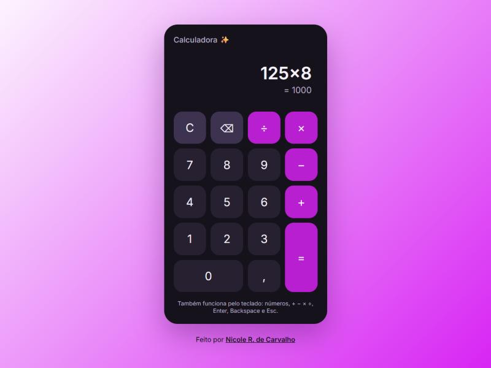

# 🧮 Calculadora

Calculadora web feita com **HTML, CSS e JavaScript puro**, sem bibliotecas e **sem `eval`**: as expressões são calculadas por um avaliador próprio, com testes automatizados.

🔗 **[Abrir a calculadora](https://nicole21carvalho.github.io/Calculadora/)**

<p align="center">
  
</p>

## ✨ Funcionalidades

- ➕ Soma, subtração, multiplicação e divisão, respeitando a precedência (`2+3×4 = 14`)
- 🔢 Números decimais com vírgula e números negativos
- ⌨️ Funciona pelo teclado: números, `+ - * /`, `Enter`, `Backspace` e `Esc`
- ⚠️ Avisa sobre divisão por zero e expressões incompletas
- 📱 Layout responsivo, que se adapta à tela do celular
- ♿ Botões com descrição para leitores de tela e foco visível na navegação por teclado

## 🧠 Decisões técnicas

- **Sem `eval`:** o `eval` executa qualquer código JavaScript, o que é um risco de segurança. No lugar dele, o [`calc.js`](calc.js) separa a expressão em números e operadores e resolve com o algoritmo *shunting-yard*, que respeita a precedência.
- **Ponto flutuante:** o resultado é arredondado para 12 dígitos significativos, então `0,1 + 0,2` dá `0,3` e não `0,30000000000000004`.
- **Lógica separada da interface:** o cálculo fica em `calc.js` e a interação com a página em `script.js`, o que permite testar o cálculo sem abrir o navegador.

## 🛠️ Tecnologias

HTML · CSS (Grid, variáveis CSS) · JavaScript · Node.js Test Runner

## 📁 Estrutura

```
index.html     → estrutura da calculadora
style.css      → visual
calc.js        → avaliador de expressões (sem eval)
script.js      → botões, teclado e tela
calc.test.js   → testes do avaliador
```

## 🚀 Como executar

Abra o [site publicado](https://nicole21carvalho.github.io/Calculadora/) ou baixe o repositório e abra o `index.html` no navegador.

Para rodar os testes (precisa do [Node.js](https://nodejs.org/) 18 ou mais recente):

```bash
node --test
```
